<div align="center">

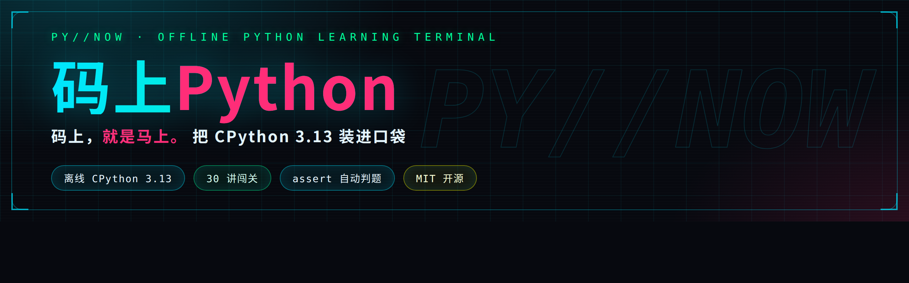

**今すぐコードを書こう。オフラインのまま、どこでも Python をマスター。**

ポケットに入るサイバーパンク風 Python 学習ターミナル：本物の **CPython 3.13** インタープリターを内蔵、
30 講のステップアップ講座、assert 自動採点、変数可視化、6 段階ランク成長システム。

[](https://github.com/X33834/mashang-python/actions)
[](LICENSE)
[]()
[]()
[]()
[](#-カリキュラム30-講--4-幕)
[](https://aa84776376caeb1e2.app.workbuddy.host)

🌐 [English](README.md) | [中文](README.zh-CN.md) | [日本語](README.ja-JP.md)

[🎬 予告編](#-予告編50-秒) · [⚡ TL;DR](#-tldr30-秒) · [📊 仕組み](#-なぜオフラインで動くのか) · [📥 ダウンロード](#-ダウンロードとインストール) · [カリキュラム](#-カリキュラム30-講--4-幕) · [⭐ Star](../../stargazers)

</div>

---

## 🎬 予告編 · 50 秒

<p align="center">
  <video src="demo/promo-video.mp4" poster="demo/promo-poster.jpg" controls width="380"></video>
  <br/>
  <a href="demo/promo-video.mp4">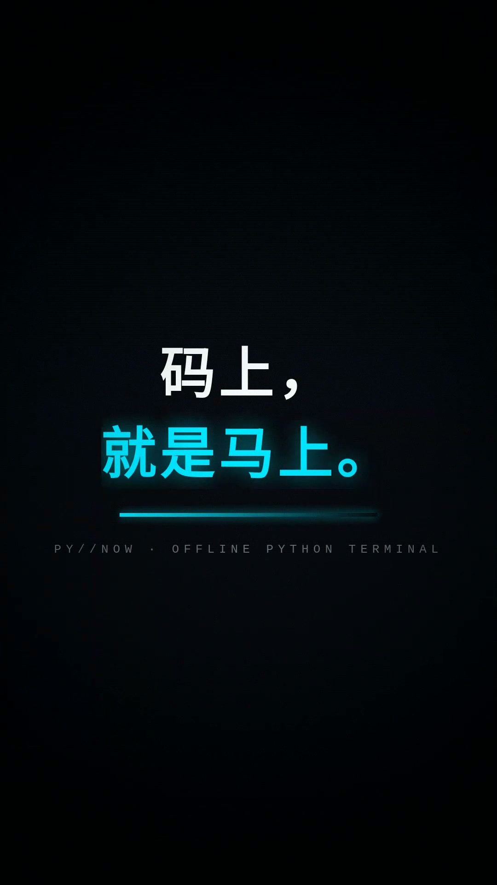</a>
  <br/>
  <sub>▶ ポスターをクリックで再生 · <a href="demo/promo-video.mp4">動画を直接開く</a>（MP4, 1080×1920, 約 50 秒, オリジナルシンセサウンドトラック）</sub>
</p>

> 🌐 [オンラインダウンロードページ](https://aa84776376caeb1e2.app.workbuddy.host) — スマホで開けばスクリーンショット・動画・QR コードからのダウンロード。アカウント不要

## ⚡ TL;DR · 30 秒で分かる

| よくある疑問 | ひとことで |
|---|:--|
| **オフラインで使える？** | ✅ **完全オフライン** — CPython 3.13 を APK に丸ごと内蔵。地下鉄のトンネルでも書いて・動かして・採点まで完結 |
| **本当に「書ける」ようになる？** | ✅ **assert 自動採点** — テストケースを通すまで先に進めない。「わかったつもり」を治す |
| **広告やアカウント登録は？** | ✅ **広告ゼロ · アカウント不要 · データ送信ゼロ**、MIT ライセンス。生徒に安心して勧められる |
| **独自機能は？** | 🔬 **変数スナップショット**（実行後の名前空間を丸ごと可視化）· 6 段階ランク · デイリークエスト · 間隔復習 |
| **学習ボリュームは？** | 📚 **メイン 30 講 + アルゴリズム 10 講**、`print` からデコレーターまで、アリーナ 6 大チャレンジ |

> 🎯 **ひとことで**：空白エディタを渡すアプリではなく、**CPython インタープリター + 採点エンジン + ゲーム的成長**を全部スマホに詰め込んだオフライン学習ターミナル。

## 📊 なぜオフラインで動くのか

他アプリはクラウド実行ゆえに回線が切れると停止。**码上Python** は完全な CPython 3.13 を APK に直接埋め込み、すべてのコードをスマホ本体上で実行します。その実行チェーンがこれ：

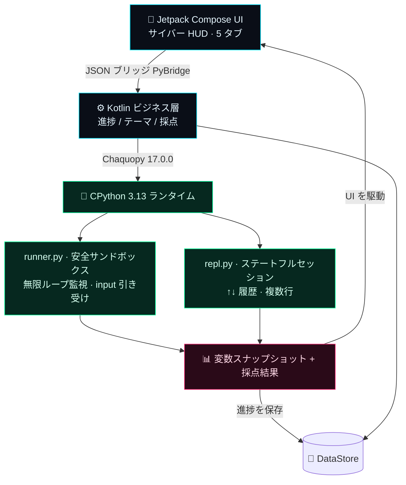

> 通信が発生するのは「コンテンツハブ」でコースパックを手動取得するときだけ（sha256 検証、個人データは一切送信なし）。学習・コーディング・採点は 100% オフライン。

## 🔁 学習ループ — 書けるまで放さない

「動画を見て忘れる」ではなく、手を動かすことを強制する闭环：書く → 実行 → 採点 → ダメなら指導 → 通ったら昇格。

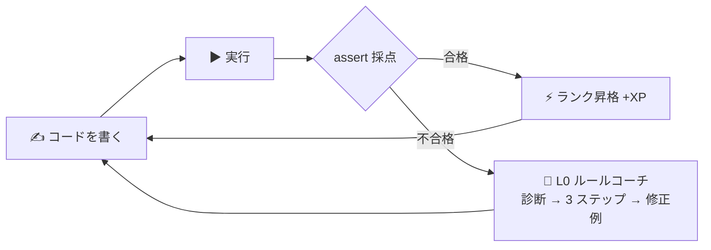

## 📈 コンテンツ規模

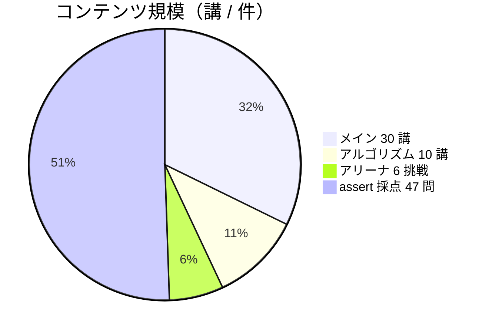

## 🏆 6 段階ランク成長

ゲームのようにレベルアップ — 「スクリプトキディ」から「システムアーキテクト」まで：

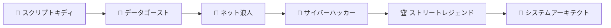

ランクが上がるごとに新称号 + ネオン実績ウォールが解放。全コース修了で**卒業証書**（ネオン認定ページ、スクショしてシェア）を獲得。

## 📱 実機スクリーンショット

| ホーム | 講座一覧 | 講座詳細 |
|:--:|:--:|:--:|
| 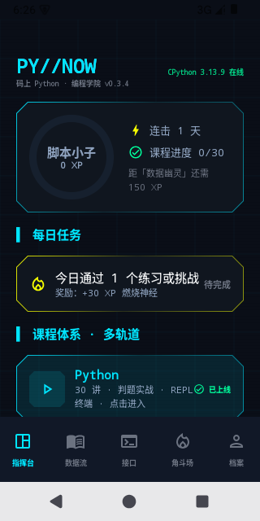 | 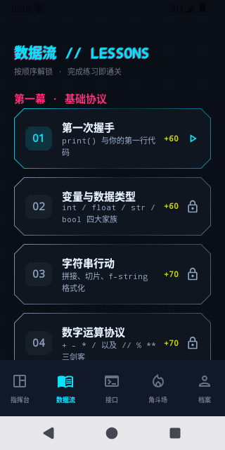 | 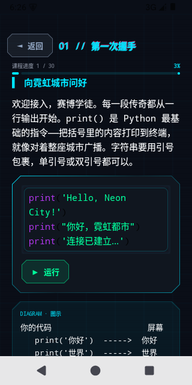 |

| テーマ | プロフィール | アリーナ |
|:--:|:--:|:--:|
| 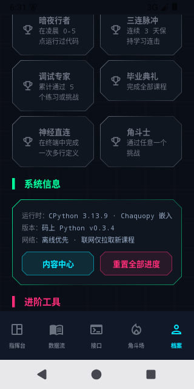 | 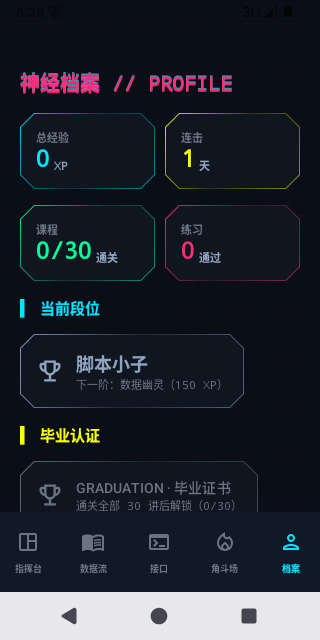 | 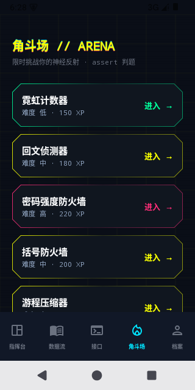 |

| ウェルカム |
|:--:|
| 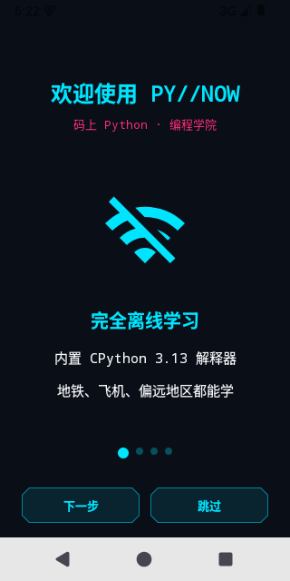 |

## 🎥 使用デモ · 57 秒

<p align="center">
  <video src="demo/usage-video.mp4" poster="demo/shots/home.png" controls width="380"></video>
  <br/>
  <a href="demo/usage-video.mp4">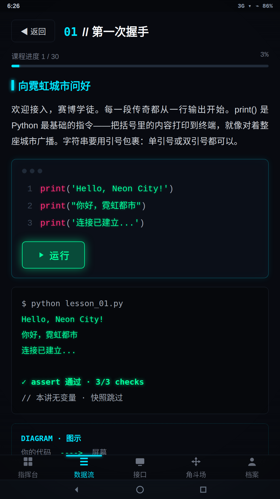</a>
  <br/>
  <sub>▶ クリックで再生 · <a href="demo/usage-video.mp4">動画を直接開く</a>（MP4, 1080×1920, 約 57 秒）</sub>
</p>

## 👤 こんな人におすすめ

| あなたは | 得られるもの |
|---|---|
| 初学者 / キャリアチェンジャー | `print` からデコレーターまで、30 講の日本語ナラティブ講座 |
| 通勤・隙間時間学習者 | 完全オフライン、地下鉄のトンネルでもコード実行 |
| 教師 / 保護者 | 広告なし・アカウント不要・データ送信ゼロ、生徒に安心 |
| 開発者 | Compose + Chaquopy の完全リファレンス実装、MIT |

## なぜ PY//NOW なのか

| | 他のアプリ | PY//NOW |
|---|---|---|
| コード実行 | ☁️ クラウド依存、回線切れで停止 | 📱 **端末内 CPython 3.13** |
| 教育スタイル | 乾いたドキュメント | サイバーナラティブ + 生活比喩 + 随時クイズ |
| 実行フィードバック | 黒い画面の print | **変数スナップショットパネル** + 結果即時表示 |
| 成長モチベーション | チェックインカレンダー | **XP / 6 段階 / デイリークエスト / 実績ウォール** |

## ✨ 特徴一覧

### 🧠 学習ループ — 書けるまで

- ✅ **assert 自動採点** — テストケース合格でクリア。「わかったつもり」を防ぐ
- ✍️ **穴埋め + 🧩 コード並べ替え** — Mimo 対標の低障壁問題：欠落部分だけ入力 / バラバラの行を正しいプログラムに並べ替え
- 🧭 **L0 ルールコーチ** — エラー即指導：オフラインルールエンジンが「診断 → 3 ステップ → 修正例」を提示。答えは書かない
- 📖 **間違いノート + 間隔復習** — ミスは自動収集、当日/1 日/3 日/7 日…の間隔で復習
- 🧭 **手取り足取りガイド** — 毎講標準：生活比喩 → ASCII 図解 → TASK フォロー → PRACTICE 実践 → STEPS 思考カード

### 🔥 エンジン — オフラインで動く

- 🔌 **完全オフライン CPython 3.13** — Chaquopy 内蔵の本物インタープリター。通信はコンテンツハブのコースパック取得のみ（sha256 検証、個人データなし）
- 🛡 **安全サンドボックス** — 無限ループ監視の強制中断、`input()` の入力キュー引き受け、例外の親切な中国語化
- 🎹 **コードエディタ** — Python 構文ネオンハイライト、スマートインデント（`:` で自動一段）、Tab 補完
- 🖥 **神経インターフェース REPL** — ステートフルセッション、↑↓ 履歴、複数行ブロック、ワンタップリセット
- 🔬 **変数スナップショット** — 実行のたびに名前空間内の全変数の名前/型/値を表示

### 🏆 ゲーミフィケーション — ゲームのように学ぶ

- 🏆 **6 段階ランク** — スクリプトキディ → データゴースト → ネット浪人 → サイバーハッカー → ストリートレジェンド → システムアーキテクト
- ⚡ **デイリークエスト / XP / 連続記録** — 毎日ゴールがあり、実行のたびにフィードバック
- 📦 **コンテンツハブ** — コースパック方式：組み込み関数巡礼 + DSA 基礎/応用（10 講）、ワンタップでダウンロード
- 🎓 **卒業証書** — 全コース修了でネオン認定ページが解放、スクショしてシェア

### 🧩 エンジニアリング品質

- 🎨 **6 カラーテーマ** — サイバーネオン / ディープスペースグレー / オーロラグリーン / トワイライトパープル / トワイライトオレンジ / ペーパーホワイト、再起動不要の即時切替
- 👓 **可読性ファースト** — 演出は装飾ゾーンのみ；講座本文と採点結果は大きめのサンセリフで直表示
- ⚡ **アプリ内自己更新** — 設定の「更新を確認」から GitCode リポジトリへアクセス、SHA-256 検証後にシステムインストーラーへ

## 📥 ダウンロードとインストール

> ⚡ **最速ルート** → 🌐 [オンラインダウンロードページ](https://aa84776376caeb1e2.app.workbuddy.host)：QR コードをスキャンまたはタップ。予告編・スクショ・インストールガイド付き。
> 🛰 **GitHub Pages ミラー** → [x33834.github.io/mashang-python](https://x33834.github.io/mashang-python/)（同ページ + アーキテクチャ図解付き）

> Android 7.0+（minSdk 24）、arm64-v8a / x86_64 デュアルアーキテクチャ。Release ビルドは R8 難読化済み。

- ⭐ おすすめ：[Releases](../../releases)（GitCode）から最新の `pynow-*.apk` をダウンロード
- 自分でビルド：

```bash
./gradlew :app:assembleDebug        # Debug ビルド
./gradlew :app:bundleRelease        # ストア用 AAB（keystore.properties が必要）
python tests/test_engine_desktop.py   # エンジン単体テスト
python tests/validate_content.py      # 講座 × 解答キー全量検証
```

## ❓ FAQ

**Q: 本当に完全オフライン？ネットワーク権限は何に使うの？**
学習・コーディング・採点は 100% オフライン。通信は「コンテンツハブ」でコースパックを手動チェック/ダウンロードするときだけで、個人データは一切送信されません。

**Q: Pydroid3 などの IDE と何が違う？**
Pydroid は開発ツール。私たちは「講座即コード」の学習ターミナル — 各講に採点チャレンジと成長システムが付属。目標は**教えること**で、空白エディタを渡すことではありません。

**Q: iOS 版は出ますか？**
技術スタック（Chaquopy）は Android のみ対応。iOS は別方式が必要で、長期ロードマップで検討中です。

**Q: 講座内容を商用利用できる？**
はい。**MIT ライセンス**で公開 — ライセンス表示を残せば自由に利用・改変・配布（商用含む）できます。詳細は [LICENSE](LICENSE)。

## 📚 カリキュラム（30 講 · 4 幕）

<details open>
<summary><b>第一幕 · 基礎プロトコル</b>（クリックで折りたたみ）</summary>

`01 最初の握手` · `02 変数とデータ型` · `03 文字列アクション` · `04 数値演算プロトコル` · `05 入力信号` · `06 条件分岐マトリックス` · `07 ループエンジン` · `08 リスト倉庫` · `09 辞書キーボールト` · `10 基礎編卒業式`

</details>

<details>
<summary><b>第二幕 · 進化装備</b></summary>

`11 文字列百宝箱` · `12 タプルと集合` · `13 関数進化論(*args/**kwargs)` · `14 内包表記の嵐` · `15 例外シールド` · `16 データ永続化(ファイル/JSON)` · `17 モジュール召喚術` · `18 クラスとオブジェクト覚醒`

</details>

<details>
<summary><b>第三幕 · 高階義体</b></summary>

`19 継承と魔法メソッド` · `20 総合プロジェクト·サイバー銀行` · `21 ジェネレーターエンジン` · `22 デコレータースーツ` · `23 lambda 三銃士` · `24 標準ライブラリ実戦(Counter/re)` · `25 時間とランダム宇宙` · `26 卒業プロジェクト·ログアナライザー` · `27 イースターエッグ·組み込み関数巡礼(コンテンツハブ初公開)`

**終幕 · 境界の外** — Python コアはここで制覇：
`28 ファイル入出力プロトコル` · `29 カスタム例外` · `30 モジュールとメインガード(__main__)`

</details>

各講に含まれるもの：**実行可能サンプル + OUTPUT プレビュー + 図解/表 + QUIZ 随時質問 + assert 採点実戦**
さらにアリーナ 6 大チャレンジ：ネオンカウンター / 回文探知器 / パスワード強度ファイアウォール / 括弧ファイアウォール / ランレングス圧縮器 / 在庫管理者。

## 🧱 技術スタック

```
Kotlin + Jetpack Compose (Material3 サイバー Custom Theme)
        │  JSON ブリッジ PyBridge
Chaquopy 17.0.0 ──► CPython 3.13 (runner.py サンドボックス / repl.py セッション)
DataStore 進捗保存 │ Navigation 単 Activity 5 タブ │ 自作構文ハイライター
```

視覚的な実行チェーンは上の [なぜオフラインで動くのか](#-なぜオフラインで動くのか) のアーキテクチャ図を参照。

## 🗺 ロードマップ

- [x] v0.1 MVP：エンジン闭环 + 7 画面 + 採点
- [x] v0.2 コンテンツ大爆発：26 講 + 4 種類の新コンテンツブロック（表/図解/随時問/出力プレビュー）
- [x] v0.2.1 コンテンツハブ：オンラインコースパック DL（端末クラウド協調）、初回パック「組み込み関数巡礼」
- [x] v0.3 成果：DSA 増補パック ×2（10 講）、L0 オフラインルールコーチ、間違いノート + 間隔復習、UI 可読性リファイン
- [ ] v0.3 残り：turtle キャンバス · matplotlib チャート出力 · 実行中変数アニメーション
- [ ] v0.4 端末側 AI チューター（オンライン LLM）· 多言語 · タブレット対応
- [ ] v1.0 アプリストア全チャネル リリース

## 🤝 コントリビューション

あらゆる形を歓迎：新しい講座コンテンツ、バグ報告、UI 磨き上げ、多言語翻訳。
Fork → ブランチ作成 → PR 提出；講座コンテンツは `tests/validate_content.py` の解答キーを同期更新し、全件 PASS を確認してください。

## 📄 ライセンス & プライバシー

本リポジトリは **MIT ライセンス** で公開：ライセンス表示を残せば、個人・教育・商用を問わず自由に利用・改変・配布できます。

- ✅ 閲覧・学習・改変・再配布、さらに商用製品の構築も可能。
- ✅ 「現状有姿」で提供、いかなる保証もなし。リスクは自己責任。
- ™ 「PY//NOW」/「码上 Python」の名称とロゴは登録商標として保持されます。

サードパーティコンポーネント：[Chaquopy](https://github.com/chaquo/chaquopy) (MIT)、Jetpack Compose (Apache-2.0)。

📄 [プライバシーポリシー](PRIVACY_POLICY.md) · [利用規約](TERMS_OF_SERVICE.md)
