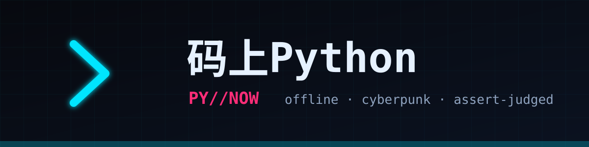

<div align="center">



**Code now, master Python instantly. Learn offline, anywhere.**

A cyberpunk-styled Python learning terminal that fits in your pocket: embedded real CPython interpreter, 30-level gamified curriculum, auto-grading with assert, variable visualization, and six-tier progression system.

[](LICENSE)
[]()
[]()
[]()
[](#curriculum-30-lessons--4-acts)
[](CONTRIBUTING.md)
[](../../stargazers)

🌐 [English](README.md) | [中文](README.zh-CN.md) | [日本語](README.ja-JP.md)

[Download APK](#download-install) · [Curriculum](#curriculum-30-lessons--4-acts) · [Contributing](#contributing) · [Roadmap](#roadmap)

</div>

---

## 🖥 What It Looks Like

```text
╔══════════════════════════════════╗
║  PY//NOW · Mashang Python   ● CPython 3.13 Online
╠══════════════════════════════════╣
║  ▍Practice · Access Guard
║  ┌────────────────────────────┐
║  │ def access(level):         │  ← Neon syntax highlighting
║  │     if level >= 100:       │
║  └────────────────────────────┘
║  [▶ Run & Grade]  [💡 Hint]
║  ────────────────────────────
║  ROOT                    ← Typewriter output
║  // Variable Snapshot            ← App-exclusive feature
║  (level:int) 120   (r:str) 'ROOT'
╚══════════════════════════════════╝
```
> Real device screenshots coming soon; the terminal frame above shows the actual in-app information structure.

## 👤 Who Is This For

| You Are | You Get |
|---|---|
| Beginner / Career Changer | 30 Chinese narrative lessons, from `print` to decorators |
| Commuter / Fragmented Learner | Fully offline, code even in subway tunnels |
| Teacher / Parent | No ads, no account, zero data upload — safe for students |
| Developer | Complete Compose + Chaquopy reference implementation, MIT commercial use |

## Why PY//NOW?

Most programming learning apps either rely on cloud execution or look like dry manuals.
**PY//NOW** embeds a complete **CPython 3.13 interpreter** directly into the APK—
code, run, and pass challenges without internet; paired with CRT scanlines and neon glitch typography for a cyberpunk HUD,
making "learning to code" feel like playing a game for the first time.

| | Others | PY//NOW |
|---|---|---|
| Code Execution | ☁️ Cloud-based, dead without net | 📱 On-device CPython 3.13 |
| Teaching Style | Dry documentation | Cyber narrative + life analogies + pop quizzes |
| Runtime Feedback | Black-box print | Typewriter streaming + **Variable Snapshot Panel** |
| Growth Motivation | Check-in calendar | XP / Six Tiers / Daily Quests / Achievement Wall |

## ✨ Features

- 🔌 **Fully Offline Engine** — Chaquopy-embedded CPython; network only for Content Hub course downloads (zero personal data collection/upload)
- 🔌 **Offline First, Online Enhanced** — Learn without internet; one-tap pull of new course packs via Content Hub (Gitee/GitCode/GitHub triple-mirror fallback)
- 🛡 **Sandbox Security** — Dead-loop watchdog force-interrupt, input queue takeover for `input()`, friendly localized exceptions
- 🎹 **Code Editor** — Neon Python syntax highlighting, smart indentation (`:` auto-indent), Tab-to-space
- 🖥 **Neural Interface REPL** — Stateful session, ↑↓ history, multi-line blocks, one-tap reset
- 🔬 **Variable Snapshot** — Post-run display of every variable's name/type/value in namespace
- ✅ **Assert Grading** — Must pass test cases to advance, preventing "understood but can't code"
- ✍️ **Fill-in-the-Blank + 🧩 Code Sorting** — Mimo-style low-barrier题型: type missing fragments / sort shuffled lines into correct program
- 🎓 **Graduation Certificate** — Unlock neon certification page upon completing all courses, screenshot to share
- 🧭 **Hand-holding Guidance** — Each lesson includes: life analogy → ASCII diagram → TASK follow-along → PRACTICE hands-on → STEPS thinking card
- 🏆 **Gamification** — Script Kiddie → Data Ghost → Network Ronin → Cyber Hacker → Street Legend → System Architect

## 📥 Download & Install

> Android 7.0+ (minSdk 24), arm64-v8a / x86_64 dual architecture, APK ~43MB.

- ⭐ Recommended: Download `app-release.apk` from [GitHub Releases](../../releases)
- China Direct: [Gitee Repository](https://gitee.com/badhope/mashang-python) synchronized release
- Build yourself:

```bash
./gradlew :app:assembleDebug        # Debug build
./gradlew :app:bundleRelease        # Store AAB (requires keystore.properties)
python tests/test_engine_desktop.py   # Engine unit tests
python tests/validate_content.py      # Full curriculum × answer key validation
```

## ❓ FAQ

**Q: Is it really fully offline? What's the network permission for?**
Learning, coding, and grading are 100% offline. Network is only used when manually checking/downloading new course packs in "Content Hub", with zero personal data transmitted.

**Q: How is this different from Pydroid3 or other IDEs?**
Pydroid is a development tool; we're a "curriculum-as-code" learning terminal—each lesson comes with graded challenges and a growth system. Our goal is to teach you, not just give you a blank editor.

**Q: Will there be an iOS version?**
The tech stack (Chaquopy) only supports Android; iOS would require a different approach and is on the long-term roadmap.

**Q: Can I use the curriculum commercially?**
The source is open-sourced under the **Source-Available Non-Commercial License** for learning and study. You're welcome to build your own learning fork and contribute back, but **commercial use (paid distribution, in-app purchase, ads, embedding in commercial products) requires prior written permission** from the copyright holder.

## 📚 Curriculum (30 Lessons · 4 Acts)

<details open>
<summary><b>Act I · Foundation Protocol</b> (click to collapse)</summary>

`01 First Handshake` · `02 Variables & Types` · `03 String Operations` · `04 Numeric Protocols` · `05 Input Signals` · `06 Conditional Branching Matrix` · `07 Loop Engines` · `08 List Warehouses` · `09 Dictionary Key Vaults` · `10 Foundation Graduation`

</details>

<details>
<summary><b>Act II · Advanced Gear</b></summary>

`11 String Toolbox` · `12 Tuples & Sets` · `13 Function Evolution (*args/**kwargs)` · `14 Comprehension Storm` · `15 Exception Shields` · `16 Data Persistence (Files/JSON)` · `17 Module Summoning` · `18 Class & Object Awakening`

</details>

<details>
<summary><b>Act III · High-Tier Implants</b></summary>

`19 Inheritance & Magic Methods` · `20 Capstone Project · Cyber Bank` · `21 Generator Engines` · `22 Decorator Suits` · `23 Lambda Trio` · `24 Standard Library Combat (Counter/re)` · `25 Time & Random Universe` · `26 Graduation Project · Log Analyzer` · `27 Easter Egg · Built-in Function Tour (Content Hub Exclusive)`

**Final Act · Beyond the Boundary** — Master Python core here:
`28 File I/O Protocols` · `29 Custom Exceptions` · `30 Modules & Main Guard (__main__)`

</details>

Each lesson includes: **Runnable Example + OUTPUT Preview + Diagram/Table + QUIZ Pop Question + Assert Grading Challenge**
Plus Arena 6 Major Challenges: Neon Counter / Palindrome Detector / Password Strength Firewall / Bracket Firewall / Run-Length Compressor / Inventory Manager.

## 🧱 Tech Stack

```
Kotlin + Jetpack Compose (Material3 Cyber Custom Theme)
        │  JSON Bridge PyBridge
Chaquopy 16.0 ──► CPython 3.13 (runner.py sandbox / repl.py session)
DataStore Progress │ Navigation Single-Activity Five-Tab │ Custom Syntax Highlighter
```

## 🗺 Roadmap

- [x] v0.1 MVP: Engine loop + 7 screens + grading
- [x] v0.2 Content Explosion: 26 lessons + 4 new content blocks (tables/diagrams/pop questions/output preview)
- [x] v0.2.1 Content Hub: Online course pack download (device-cloud synergy), debut pack "Built-in Function Tour"
- [ ] v0.3 Turtle Canvas · matplotlib Chart Output · Execution Process Variable Animation
- [ ] v0.4 On-device AI Tutor · Mistake Notebook
- [ ] v1.0 Multi-language · Tablet Adaptation · Full-channel App Store Launch

## 🤝 Contributing

All forms welcome: new lesson content, bug reports, UI polish, multi-language translations.
Fork → New branch → Submit PR; for course content, please update answer keys in `tests/validate_content.py` and ensure all PASS.

## 📄 License &amp; Privacy

This repository is published under the **Source-Available Non-Commercial License** — open for learning, study, and exchange to assert project sovereignty, while the copyright holder reserves all commercialization rights.

- ✅ You may view, study, modify, and redistribute the source for **non-commercial, educational** purposes (keep the license notice).
- ❌ **Commercial use is prohibited without prior written permission** (paid distribution, IAP, ads, embedding in commercial products, etc.).
- ™ "PY//NOW" / "码上Python" names and logos are reserved trademarks.

Third-party components: [Chaquopy](https://github.com/chaquo/chaquopy) (MIT), Jetpack Compose (Apache-2.0).

📄 [Privacy Policy](PRIVACY_POLICY.md) · [Terms of Service](TERMS_OF_SERVICE.md)

<div align="center">

**If this project helps you, give it a ⭐ to help more learners discover it!**

</div>
