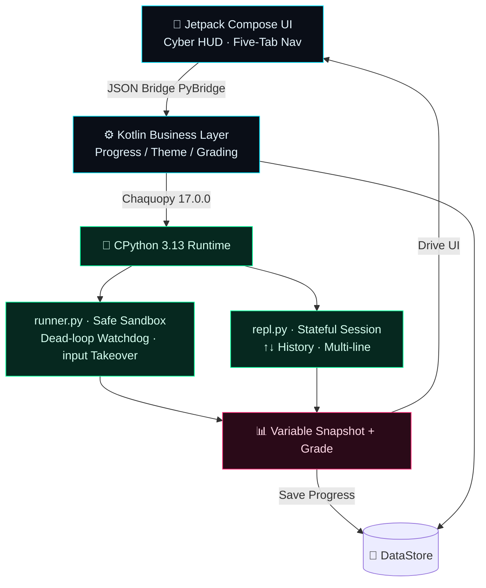
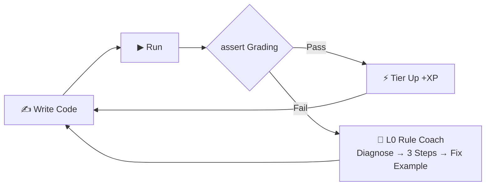
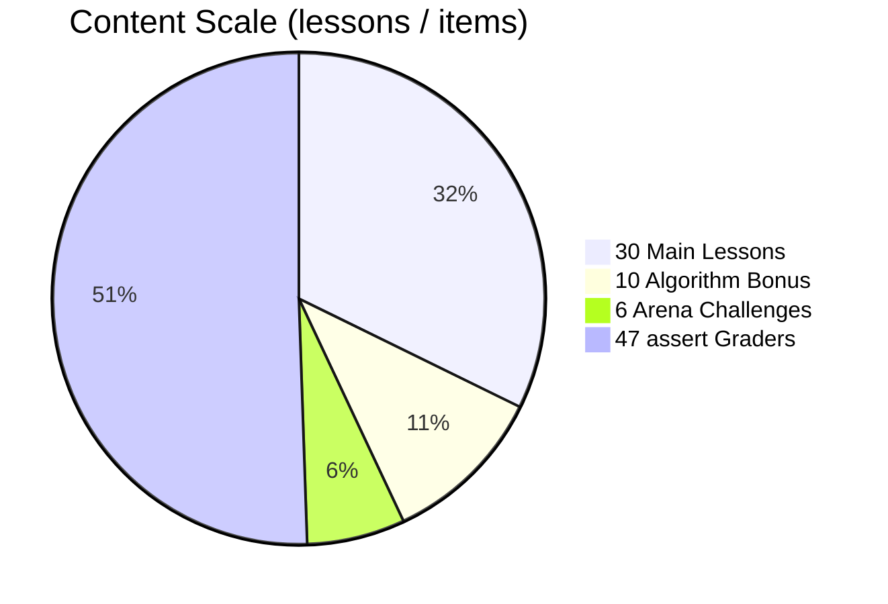
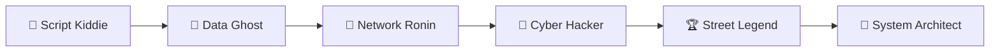

<div align="center">


**Code now, master Python instantly. Learn offline, anywhere.**

A cyberpunk-styled Python learning terminal that fits in your pocket: embedded real CPython interpreter, 30-level gamified curriculum, auto-grading with assert, variable visualization, and six-tier progression system.

[](https://github.com/X33834/mashang-python/actions)
[](LICENSE)
[]()
[]()
[]()
[](#curriculum-30-lessons--4-acts)
[](https://aa84776376caeb1e2.app.workbuddy.host)

🌐 [English](README.md) | [中文](README.zh-CN.md) | [日本語](README.ja-JP.md)

[🎬 Trailer](#-trailer50-seconds) · [⚡ TL;DR](#-tldr30-seconds) · [📊 How it runs](#-how-it-runs-fully-offline) · [📥 Download](#download--install) · [Curriculum](#curriculum-30-lessons--4-acts) · [⭐ Star](../../stargazers)

</div>

---

## 🎬 Trailer · 50 Seconds

<p align="center">
  <video src="demo/promo-video.mp4" poster="demo/promo-poster.jpg" controls width="380"></video>
  <br/>
  <a href="demo/promo-video.mp4"></a>
  <br/>
  <sub>▶ Click the poster to watch · <a href="demo/promo-video.mp4">open video directly</a> (MP4, 1080×1920, ~50s, original synth soundtrack)</sub>
</p>

> 🌐 [Online download page](https://aa84776376caeb1e2.app.workbuddy.host) — screenshots, videos and QR download on your phone, no account needed

## ⚡ TL;DR · 30 Seconds

| You Ask | One-Line Answer |
|---|:--|
| **Does it work offline?** | ✅ **Truly offline** — a full CPython 3.13 interpreter is embedded in the APK; code, run and get graded in subway tunnels |
| **Will I actually learn to code?** | ✅ **Assert auto-grading** — you don't advance until test cases pass; cures "understood but can't write" |
| **Ads? Account? Tracking?** | ✅ **Zero ads · zero account · zero data upload**, MIT-licensed — safe to recommend to students |
| **Anything unique?** | 🔬 **Variable Snapshot panel** (whole namespace visualized after each run) · Six Tiers · Daily Quests · Mistake Book |
| **How much content?** | 📚 **30 main lessons + 10 algorithm bonus lessons**, from `print` to decorators, plus 6 Arena challenges |

> 🎯 **One-line pitch**: not another blank code editor — a pocket learning terminal that bundles a **CPython interpreter + grading engine + game-like progression**, fully offline.

## 📊 How It Runs Fully Offline

Others rely on cloud execution and die without a network. **PY//NOW** embeds a complete CPython 3.13 interpreter right into the APK — every line of code runs on this phone. Here is the runtime chain:



> Network is used **only** when you manually fetch course packs in "Content Hub" (sha256-verified, zero personal data). Learning, coding, and grading are 100% offline.

## 🔁 The Learning Loop — Until You Can Code It

Not "watch a video → forget". A closed loop that forces you to write: type → run → grade → coach if failed → tier up only when passed.



## 📈 Content At A Glance



## 🏆 Six-Tier Progression

Level up like a game — from "Script Kiddie" all the way to "System Architect":



Each tier unlocks a new title + neon achievement wall. Complete every course to earn a **Graduation Certificate** (neon cert page, screenshot to share).

## 📱 Screenshots

| Home | Lessons | Lesson Detail |
|:--:|:--:|:--:|
|  |  |  |

| Themes | Profile | Arena |
|:--:|:--:|:--:|
|  |  |  |

| Welcome |
|:--:|
|  |

## 🎥 Usage Demo · 57s Hands-on

<p align="center">
  <video src="demo/usage-video.mp4" poster="demo/shots/home.png" controls width="380"></video>
  <br/>
  <a href="demo/usage-video.mp4"></a>
  <br/>
  <sub>▶ Click to watch · <a href="demo/usage-video.mp4">open video directly</a> (MP4, 1080×1920, ~57s)</sub>
</p>

## 👤 Who Is This For

| You Are | You Get |
|---|---|
| Beginner / Career Changer | 30 Chinese narrative lessons, from `print` to decorators |
| Commuter / Fragmented Learner | Fully offline, code even in subway tunnels |
| Teacher / Parent | No ads, no account, zero data upload — safe for students |
| Developer | Complete Compose + Chaquopy reference implementation, MIT-licensed |

## Why PY//NOW?

| | Others | PY//NOW |
|---|---|---|
| Code Execution | ☁️ Cloud-based, dead without net | 📱 **On-device CPython 3.13** |
| Teaching Style | Dry documentation | Cyber narrative + life analogies + pop quizzes |
| Runtime Feedback | Black-box print | **Variable Snapshot Panel** + instant result display |
| Growth Motivation | Check-in calendar | **XP / Six Tiers / Daily Quests / Achievement Wall** |

## ✨ Features

### 🧠 Learning Loop — Until You Can Code It

- ✅ **Assert Grading** — must pass test cases to advance, preventing "understood but can't code"
- ✍️ **Fill-in-the-Blank + 🧩 Code Sorting** — Mimo-style low-barrier exercises: type missing fragments / sort shuffled lines into a correct program
- 🧭 **L0 Rule Coach** — on-error guidance: offline rules give "diagnosis → 3 steps → fix example"; hints never write the code for you
- 📖 **Mistake Book + Spaced Repetition** — wrong answers auto-collected; reviewed on a day/1d/3d/7d… schedule
- 🧭 **Hand-holding Guidance** — each lesson: life analogy → ASCII diagram → TASK follow-along → PRACTICE hands-on → STEPS thinking card

### 🔥 Hardcore Engine — Runs Fully Offline

- 🔌 **Offline CPython 3.13** — Chaquopy-embedded real interpreter; network only for Content Hub course packs (sha256 verified, zero personal data)
- 🛡 **Sandbox Security** — dead-loop watchdog force-interrupt, input queue takeover for `input()`, friendly localized exceptions
- 🎹 **Code Editor** — neon Python syntax highlighting, smart indentation (`:` auto-indent), Tab-to-space
- 🖥 **Neural Interface REPL** — stateful session, ↑↓ history, multi-line blocks, one-tap reset
- 🔬 **Variable Snapshot** — every variable's name/type/value in the namespace, shown after each run

### 🏆 Gamification — Learning Feels Like a Game

- 🏆 **Six Tiers** — Script Kiddie → Data Ghost → Network Ronin → Cyber Hacker → Street Legend → System Architect
- ⚡ **Daily Quests / XP / Streak** — a goal every day, feedback on every run
- 📦 **Content Hub** — course pack system: Built-in Function Tour bonus + DSA Basics/Mastery packs (10 lessons), download and learn on demand
- 🎓 **Graduation Certificate** — neon certification page unlocked upon completing all courses, screenshot to share

### 🧩 Engineering Quality

- 🎨 **6 Color Themes** — Cyber Neon / Deep Space Gray / Aurora Green / Twilight Purple / Twilight Orange / Paper White, instant switch without restart
- 👓 **Readability-First UI** — effects confined to decoration zones (boot/home/terminal…); lesson body and graded results use larger sans-serif text, no gimmicks
- ⚡ **In-App Self-Update** — check for new versions in Settings, pull from GitCode repo, verify SHA-256, install via system installer

## 📥 Download & Install

> ⚡ **Fastest path** → 🌐 [Online download page](https://aa84776376caeb1e2.app.workbuddy.host): scan or tap, with trailer, screenshots and install guide.

> Android 7.0+ (minSdk 24), arm64-v8a / x86_64 dual architecture. Release builds are R8-minified.

- ⭐ Recommended: download the latest `pynow-*.apk` from [Releases](../../releases) (GitCode)
- Build yourself:

```bash
./gradlew :app:assembleDebug        # Debug build
./gradlew :app:bundleRelease        # Store AAB (requires keystore.properties)
python tests/test_engine_desktop.py   # Engine unit tests
python tests/validate_content.py      # Full curriculum × answer key validation
```

## ❓ FAQ

**Q: Is it really fully offline? What's the network permission for?**
Learning, coding, and grading are 100% offline. Network is only used when manually checking/downloading new course packs in "Content Hub", with zero personal data transmitted.

**Q: How is this different from Pydroid3 or other IDEs?**
Pydroid is a development tool; we're a "curriculum-as-code" learning terminal—each lesson comes with graded challenges and a growth system. Our goal is to teach you, not just give you a blank editor.

**Q: Will there be an iOS version?**
The tech stack (Chaquopy) only supports Android; iOS would require a different approach and is on the long-term roadmap.

**Q: Can I use the curriculum commercially?**
Yes. The project is open-sourced under the **MIT License** — free to use, modify, and distribute, including commercial use, as long as the license notice is retained. See [LICENSE](LICENSE) for the full terms.

## 📚 Curriculum (30 Lessons · 4 Acts)

<details open>
<summary><b>Act I · Foundation Protocol</b> (click to collapse)</summary>

`01 First Handshake` · `02 Variables & Types` · `03 String Operations` · `04 Numeric Protocols` · `05 Input Signals` · `06 Conditional Branching Matrix` · `07 Loop Engines` · `08 List Warehouses` · `09 Dictionary Key Vaults` · `10 Foundation Graduation`

</details>

<details>
<summary><b>Act II · Advanced Gear</b></summary>

`11 String Toolbox` · `12 Tuples & Sets` · `13 Function Evolution (*args/**kwargs)` · `14 Comprehension Storm` · `15 Exception Shields` · `16 Data Persistence (Files/JSON)` · `17 Module Summoning` · `18 Class & Object Awakening`

</details>

<details>
<summary><b>Act III · High-Tier Implants</b></summary>

`19 Inheritance & Magic Methods` · `20 Capstone Project · Cyber Bank` · `21 Generator Engines` · `22 Decorator Suits` · `23 Lambda Trio` · `24 Standard Library Combat (Counter/re)` · `25 Time & Random Universe` · `26 Graduation Project · Log Analyzer` · `27 Easter Egg · Built-in Function Tour (Content Hub Exclusive)`

**Final Act · Beyond the Boundary** — Master Python core here:
`28 File I/O Protocols` · `29 Custom Exceptions` · `30 Modules & Main Guard (__main__)`

</details>

Each lesson includes: **Runnable Example + OUTPUT Preview + Diagram/Table + QUIZ Pop Question + Assert Grading Challenge**
Plus Arena 6 Major Challenges: Neon Counter / Palindrome Detector / Password Strength Firewall / Bracket Firewall / Run-Length Compressor / Inventory Manager.

## 🧱 Tech Stack

```
Kotlin + Jetpack Compose (Material3 Cyber Custom Theme)
        │  JSON Bridge PyBridge
Chaquopy 17.0.0 ──► CPython 3.13 (runner.py sandbox / repl.py session)
DataStore Progress │ Navigation Single-Activity Five-Tab │ Custom Syntax Highlighter
```

See the [How It Runs](#-how-it-runs-fully-offline) architecture diagram above for the visual runtime chain.

## 🗺 Roadmap

- [x] v0.1 MVP: engine loop + 7 screens + grading
- [x] v0.2 content explosion: 26 lessons + 4 new content blocks (table/diagram/quiz/output preview)
- [x] v0.2.1 Content Hub: online course-pack download (client-cloud), first pack "Built-in Function Tour"
- [x] v0.3 milestone: DSA bonus packs ×2 (10 lessons), L0 offline rule coach, mistake book + spaced repetition, UI readability cleanup
- [ ] v0.3 remaining: turtle canvas · matplotlib output · runtime variable animation
- [ ] v0.4 on-device AI tutor (online LLM) · multi-language · tablet layout
- [ ] v1.0 full app-store distribution

## 🤝 Contributing

All forms welcome: new lesson content, bug reports, UI polish, multi-language translations.
Fork → New branch → Submit PR; for course content, please update answer keys in `tests/validate_content.py` and ensure all PASS.

## 📄 License & Privacy

This repository is published under the **MIT License** — free to use, modify, and distribute for any purpose (personal, educational, or commercial), provided the license notice is retained.

- ✅ You may view, study, modify, redistribute, and build commercial products upon it.
- ✅ No warranty is provided; use at your own risk.
- ™ "PY//NOW" / "码上Python" names and logos remain reserved trademarks.

Third-party components: [Chaquopy](https://github.com/chaquo/chaquopy) (MIT), Jetpack Compose (Apache-2.0).

📄 [Privacy Policy](PRIVACY_POLICY.md) · [Terms of Service](TERMS_OF_SERVICE.md)
