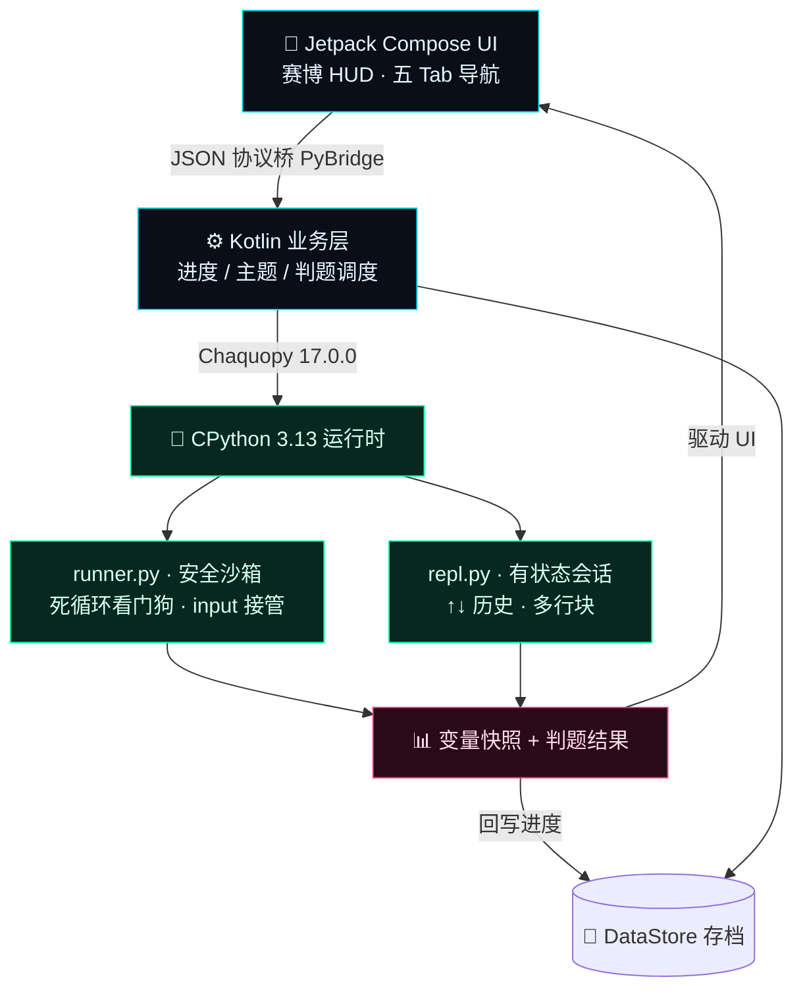
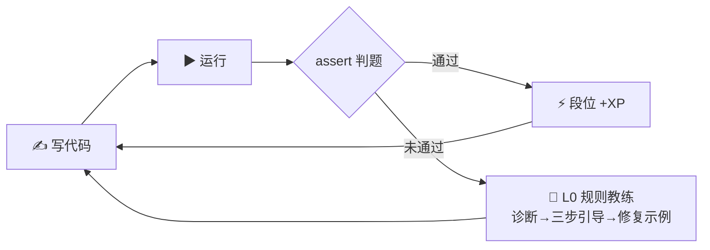
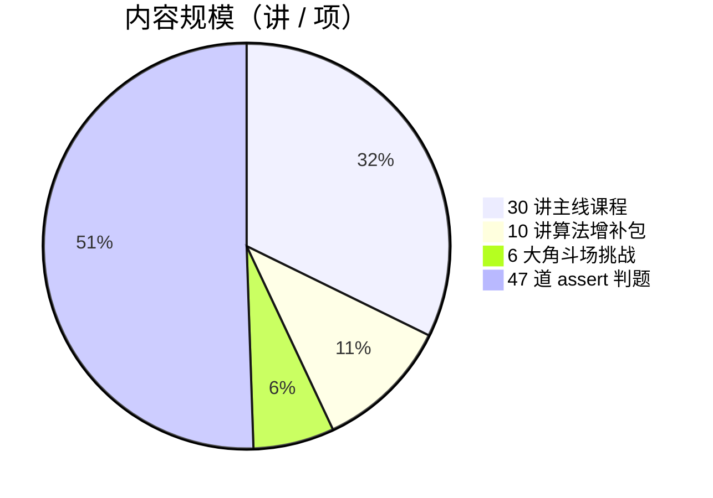

<div align="center">


**码上，就是马上。Learn Python instantly — on your phone, fully offline.**

一台装进口袋的赛博朋克 Python 学习终端：内嵌真·CPython 3.13 解释器，
30 讲闯关课程、assert 自动判题、变量可视化、六段位成长体系。

[](https://github.com/X33834/mashang-python/actions)
[](LICENSE)
[]()
[]()
[]()
[](#-课程体系30-讲--四幕)
[](https://aa84776376caeb1e2.app.workbuddy.host)

🌐 [English](README.md) | [中文](README.zh-CN.md) | [日本語](README.ja-JP.md)

[🎬 宣传片](#-宣传片50-秒入坑) · [⚡ 核心亮点](#-核心亮点30-秒速览) · [📊 它怎么离线](#-它怎么做到离线也能跑) · [📥 下载 APK](#-下载安装) · [课程体系](#-课程体系30-讲--四幕) · [⭐ Star](../../stargazers)

</div>

---

## 🎬 宣传片 · 50 秒入坑

<p align="center">
  <video src="demo/promo-video.mp4" poster="demo/promo-poster.jpg" controls width="380"></video>
  <br/>
  <a href="demo/promo-video.mp4"></a>
  <br/>
  <sub>▶ 点击海报观看 · <a href="demo/promo-video.mp4">直接打开视频</a>（MP4，1080×1920，约 50 秒，原创合成配乐）</sub>
</p>

> 🌐 [在线下载页](https://aa84776376caeb1e2.app.workbuddy.host) —— 手机打开即看截图 / 视频 / 二维码下载，无需登录任何账号

## ⚡ 核心亮点 · 30 秒速览

| 你最关心的 | 一句话答案 |
|---|:--|
| **断网还能学吗？** | ✅ **真·全离线** —— CPython 3.13 整个嵌进 APK，地铁隧道里照样写码、跑码、判题升级 |
| **学完能算「会写」吗？** | ✅ **assert 自动判题** —— 测试用例不过就不放行，专治「看懂了但不会写」 |
| **有广告 / 要注册吗？** | ✅ **零广告 · 零账号 · 零数据上传**，MIT 开源，教师可放心推给学生 |
| **独门功能是什么？** | 🔬 **变量快照面板**（运行后整个命名空间可视化）· 六段位成长 · 每日任务 · 错题本间隔复习 |
| **课程量多大？** | 📚 **30 讲主线 + 10 讲算法增补**，从 `print` 打到装饰器，另附角斗场 6 大挑战 |

> 🎯 **一句话定位**：不是又一个「空白代码编辑器」，而是一台把 **CPython 解释器 + 判题引擎 + 游戏化成长** 全塞进手机的离线学习终端。

## 📊 它怎么做到离线也能跑

别人靠云端执行、断网即瘫；**码上 Python** 把完整的 CPython 3.13 直接嵌进 APK，所有代码都在这台手机本地跑——下面这张图就是它的运行链路：



> 联网**只**在「内容中心」手动拉取课程包时发生（sha256 校验、不携带任何个人数据）。学习、写码、判题 100% 离线。

## 🔁 学习闭环 · 教会你为止

不是「看视频→忘了」，而是一套强制你动手的闭环：写完 → 跑 → 判题 → 不过就辅导 → 过了才升级。



## 📈 内容规模一览



## 🏆 六段位成长体系

像打游戏一样升级——从「脚本小子」一路打到「系统架构师」：


每升一段解锁新称号 + 霓虹成就墙，通关全部课程还会发**毕业证书**（霓虹认证页，截图即分享）。

## 📱 真机截图

| 指挥台 Home | 数据流 Lessons | 课程详情 Lesson |
|:--:|:--:|:--:|
|  |  |  |

| 主题切换 Themes | 神经档案 Profile | 角斗场 Arena |
|:--:|:--:|:--:|
|  |  |  |

| 欢迎引导 Welcome |
|:--:|
|  |

## 🎥 使用演示 · 57 秒上手实拍

<p align="center">
  <video src="demo/usage-video.mp4" poster="demo/shots/home.png" controls width="380"></video>
  <br/>
  <a href="demo/usage-video.mp4"></a>
  <br/>
  <sub>▶ 点击画面观看 · <a href="demo/usage-video.mp4">直接打开视频</a>（MP4，1080×1920，约 57 秒）</sub>
</p>

## 👤 适合谁

| 你是 | 你会得到 |
|---|---|
| 零基础学生 / 转行者 | 30 讲中文剧情课，从 print 一路打到装饰器 |
| 通勤碎片时间学习者 | 全离线，地铁隧道里也能跑代码 |
| 教师 / 家长 | 无广告、无账号、零数据上传，可放心推给学生 |
| 开发者 | Compose + Chaquopy 完整参考实现，MIT 开源 |

## 为什么是码上？

| | 别人的 | 码上 Python |
|---|---|---|
| 代码执行 | ☁️ 云端，断网即瘫 | 📱 **本机 CPython 3.13** |
| 教学风格 | 干瘪文档 | 赛博剧情 + 生活化比喻 + 随堂一问 |
| 运行反馈 | 黑框 print | **变量快照面板** + 结果直显 |
| 成长激励 | 打卡日历 | **XP / 六段位 / 每日任务 / 成就徽章墙** |

## ✨ 特性一览

### 🧠 学习闭环 —— 教会你为止

- ✅ **assert 自动判题** —— 通过测试用例才算过关，防止"看懂了但不会写"
- ✍️ **填空题 + 🧩 代码排序** —— 对标 Mimo 的低门槛题型：只敲缺失片段 / 把打乱的代码行排成正确程序
- 🧭 **L0 规则教练** —— 报错即辅导：离线规则引擎给出「诊断 → 三步引导 → 修复示例」，只提示不代写
- 📖 **错题本 + 间隔复习** —— 答错自动进错题本，按时（当天/1 天/3 天/7 天…）滚动复习
- 🧭 **手把手引导** —— 每课标配：生活化比喻 → ASCII 图解 → TASK 跟改 → PRACTICE 跟练 → STEPS 思路卡

### 🔥 引擎硬核 —— 离线也能跑

- 🔌 **全离线 CPython 3.13** —— Chaquopy 内嵌真解释器；联网仅用于「内容中心」拉取课程包（sha256 校验，不携带任何个人数据）
- 🛡 **安全沙箱** —— 死循环看门狗强制中断、输入队列接管 `input()`、异常友好汉化
- 🎹 **代码编辑器** —— Python 语法霓虹高亮、智能缩进（`:` 自动进一层）、Tab 补空格
- 🖥 **神经接口 REPL** —— 有状态会话、↑↓ 历史、多行块、一键重置
- 🔬 **变量快照** —— 每次运行后展示命名空间里每个变量的名字/类型/值

### 🏆 成长激励 —— 像打游戏一样学

- 🏆 **六段位成长** —— 脚本小子 → 数据幽灵 → 网络浪人 → 义体黑客 → 街头传奇 → 系统架构师
- ⚡ **每日任务 / XP / 连击** —— 每天有目标，每次运行有反馈
- 📦 **内容中心** —— 课程包体系：彩蛋课·内置函数巡礼 + 增补包·DSA 算法基础/进阶（10 讲），一键下载即学
- 🎓 **毕业证书** —— 通关全部课程解锁霓虹认证页，截图即分享

### 🧩 工程品质

- 🎨 **6 种颜色主题** —— 赛博霓虹 / 深空灰 / 极光绿 / 暮光紫 / 暮光橙 / 白纸模式，切换即时生效无需重启
- 👓 **可读性优先** —— 特效只用在开屏/首页/终端等装饰区；课程正文与判题结果用无衬线大字直显，不搞花活
- ⚡ **应用内自更新** —— 设置页「检查更新」从 GitCode 主仓拉取版本信息，下载 + SHA-256 校验后交给系统安装器

## 📥 下载安装

> ⚡ **最快路径** → 🌐 [在线下载页](https://aa84776376caeb1e2.app.workbuddy.host)：扫码或点链接，含宣传片、截图与安装引导。

> Android 7.0+（minSdk 24），arm64-v8a / x86_64 双架构；release 构建已开启 R8 混淆压缩。

- ⭐ 推荐：从 [Releases](../../releases)（GitCode）下载最新的 `pynow-*.apk`
- 开发者自行构建：

```bash
./gradlew :app:assembleDebug        # Debug 包
./gradlew :app:bundleRelease        # 商店用 AAB（需配置 keystore.properties）
python tests/test_engine_desktop.py   # 引擎单测
python tests/validate_content.py      # 课程×参考答案 全量校验
```

## ❓ FAQ

**Q: 真的完全离线？联网权限用来干嘛？**
学习、写码、判题 100% 离线。联网仅在「内容中心」手动检查/下载新课程包时发生，且不携带任何个人数据。

**Q: 和 Pydroid3 这类 IDE 有什么区别？**
Pydroid 是开发工具；我们是"课程即代码"的学习终端——每讲配判题实战与成长体系，目标是教会你，而不是给你一个空白编辑器。

**Q: 会出 iOS 版吗？**
技术栈（Chaquopy）仅支持 Android；iOS 需另选型，在 Roadmap 远期观察中。

**Q: 课程内容可以商用吗？**
可以。项目以 **MIT 协议** 开源——允许自由使用、修改、分发（含商用），只需保留许可声明。完整条款见 [LICENSE](LICENSE)。

## 📚 课程体系（30 讲 · 四幕）

<details open>
<summary><b>第一幕 · 基础协议</b>（点击折叠）</summary>

`01 第一次握手` · `02 变量与数据类型` · `03 字符串行动` · `04 数字运算协议` · `05 输入信号` · `06 条件分支矩阵` · `07 循环引擎` · `08 列表仓库` · `09 字典密钥库` · `10 基础篇毕业式`

</details>

<details>
<summary><b>第二幕 · 进阶装备</b></summary>

`11 字符串百宝箱` · `12 元组与集合` · `13 函数进化论(*args/**kwargs)` · `14 推导式风暴` · `15 异常护盾` · `16 数据持久化(文件/JSON)` · `17 模块召唤术` · `18 类与对象觉醒`

</details>

<details>
<summary><b>第三幕 · 高阶义体</b></summary>

`19 继承与魔法方法` · `20 综合项目·赛博银行` · `21 生成器引擎` · `22 装饰器战衣` · `23 lambda三剑客` · `24 标准库实战(Counter/re)` · `25 时间与随机宇宙` · `26 毕业项目·日志分析器` · `27 彩蛋·内置函数巡礼(内容中心首发)`

**终幕 · 边界之外** —— Python 核心在此通关：
`28 文件读写协议` · `29 自定义异常` · `30 模块与主守卫(__main__)`

</details>

每讲均含：**可运行示例 + OUTPUT 结果预览 + 图示/表格 + QUIZ 随堂一问 + assert 判题实战**
另有角斗场 6 大挑战：霓虹计数器 / 回文侦测器 / 密码强度防火墙 / 括号防火墙 / 游程压缩器 / 库存管家。

## 🧱 技术架构

```
Kotlin + Jetpack Compose (Material3 赛博定制主题)
        │  JSON 协议桥 PyBridge
Chaquopy 17.0.0 ──► CPython 3.13 (runner.py 沙箱 / repl.py 会话)
DataStore 进度存档 │ Navigation 单Activity五Tab │ 自研语法高亮器
```

更直观的运行链路见上方 [「它怎么做到离线也能跑」](#-它怎么做到离线也能跑) 的架构图。

## 🗺 Roadmap

- [x] v0.1 MVP：引擎闭环 + 7 界面 + 判题
- [x] v0.2 内容大爆炸：26 讲 + 4 种新内容块（表格/图示/随堂问/输出预览）
- [x] v0.2.1 内容中心：在线课程包下载（端云协同），首发包「内置函数巡礼」
- [x] v0.3 阶段成果：DSA 增补包 ×2（10 讲）、L0 离线规则教练、错题本 + 间隔复习、UI 可读性整改（特效收敛、正文无衬线放大）
- [ ] v0.3 剩余计划：turtle 海龟画布 · matplotlib 图表输出 · 执行过程变量动画
- [ ] v0.4 端侧 AI 助教（线上大模型）· 多语言 · 平板适配
- [ ] v1.0 应用商店全渠道上架

## 🤝 参与贡献

欢迎一切形式：新课程内容、Bug 反馈、UI 打磨、多语言翻译。
Fork → 新建分支 → 提交 PR；课程内容请同步更新 `tests/validate_content.py` 的参考答案并保证全部 PASS。

## 📄 许可与隐私

本仓库以 **MIT 协议** 开源：允许自由使用、修改、分发（个人、教育或商业用途均可），只需保留许可声明。

- ✅ 可查看、学习、修改、再分发，也可基于此构建商业产品。
- ✅ 按「原样」提供，不附带任何担保，风险自负。
- ™ "PY//NOW" / "码上 Python" 名称与标识为保留商标。

第三方组件：[Chaquopy](https://github.com/chaquo/chaquopy) (MIT)、Jetpack Compose (Apache-2.0)。

📄 [隐私政策](PRIVACY_POLICY.md) · [用户协议](TERMS_OF_SERVICE.md)
