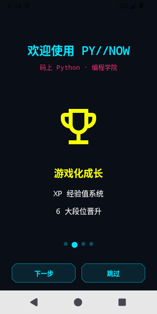
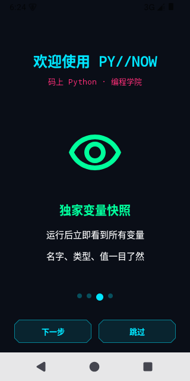
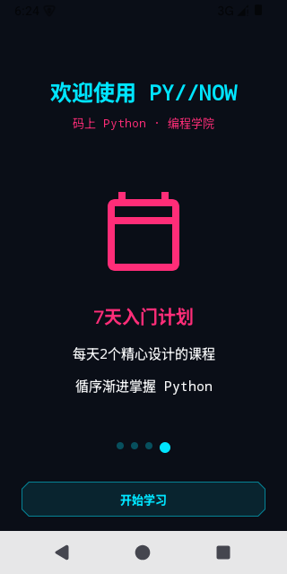
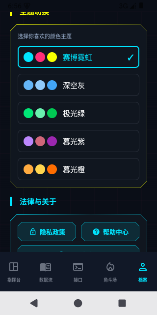

# PY//NOW 霓虹派 - 功能演示

## 项目简介
赛博朋克风离线 Python 学习终端（Android）

---

## 功能截图

### 1. 欢迎教程（4页动态页数）
| 第1页 | 第2页 | 第3页 | 第4页 |
|-------|-------|-------|-------|
|  |  |  |  |
| 完全离线学习 | 游戏化成长 | 独家变量快照 | 7天入门计划 |

### 2. 主页（指挥台）

- XP 经验值系统
- 连击统计
- 课程进度
- 每日任务

### 3. 课程列表

- 按章节组织
- 解锁进度显示
- XP 奖励提示

### 4. 课程详情（代码编辑器修复后）

- ✅ **已修复**：代码正确显示 `print('Hello, Neon City!')`
- 语法高亮
- 一键运行
- 变量快照

### 5. 角斗场（挑战系统）

- 多种难度挑战
- XP 奖励
- 实时判题

### 6. 档案页面

- 段位系统
- 成就徽章
- 毕业证书

### 7. 主题切换（新增功能）

**5 种颜色主题可选：**

| 主题 | 主色调 | 辅助色 | 强调色 | 背景色 |
|------|--------|--------|--------|--------|
| 🎆 赛博霓虹 | 青色 `#00E5FF` | 品红 `#FF2D78` | 黄色 `#F7FF00` | 深蓝黑 |
| 🌌 深空灰 | 浅蓝 `#64B5F6` | 更浅蓝 `#90CAF9` | 中蓝 `#42A5F5` | 纯深灰 |
| 🌲 极光绿 | 亮绿 `#00E676` | 浅绿 `#69F0AE` | 深绿 `#00C853` | 深绿黑 |
| 🌙 暮光紫 | 亮紫 `#BB86FC` | 粉紫 `#CF6679` | 深紫 `#9C27B0` | 深紫黑 |
| 🌅 暮光橙 | 亮橙 `#FFAB40` | 浅黄 `#FFD54F` | 深橙 `#FF6D00` | 深棕黑 |

---

## 本次修复内容

### Bug 修复
1. ✅ **代码编辑器字符丢失** - `print` 的 `t` 和 `(` 消失
2. ✅ **品牌名缺少空格** - `"码上Python"` → `"码上 Python"`
3. ✅ **硬编码课程数量** - `"30 讲"` → 动态获取
4. ✅ **颜色规范违规** - 4 个颜色值对齐 BRAND_GUIDELINES.md
5. ✅ **硬编码颜色值** - 改用颜色常量
6. ✅ **措辞不一致** - `"随时开练"` → `"随时学习"`
7. ✅ **误导性文案** - `"CPython 在线"` → `"CPython 就绪"`

### 新增功能
- 🎨 **主题切换系统** - 5 种颜色主题可选
- 💾 **主题持久化** - 选择保存在本地，重启保持

---

## 技术栈
- Android SDK 35
- Kotlin 2.4.10
- Jetpack Compose
- Chaquopy 17.0.0 (CPython 3.13)
- Material 3

---

## 构建验证
- ✅ `BUILD SUCCESSFUL`
- ✅ 40 个单元测试通过
- ✅ 模拟器端到端测试通过
